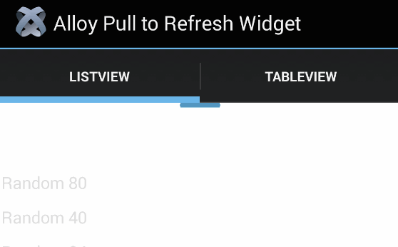
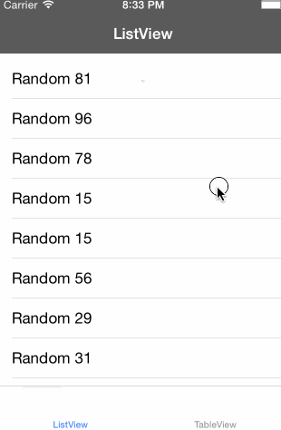

# Alloy *Pull to Refresh* Widget  

The [Alloy](http://appcelerator.com/alloy) *Pull to Refresh* widget is a cross-platform no-brainer wrapper of [Ti.UI.RefreshControl](http://docs.appcelerator.com/titanium/latest/#!/api/Titanium.UI.RefreshControl) for iOS and Ivan's fork of [Ti.SwipeRefreshLayout](https://github.com/iskugor/Ti.SwipeRefreshLayout) for Android.

Before version 2.0.0 this widget emulated the native Pull to Refresh concept for `Ti.UI.TableView` on both platforms. Since 2.0.0 it uses the native controls now available in Titanium Core and through Ivan's module for both `Ti.UI.TableView` and `Ti.UI.ListView`.

Also take a look at the [Infinite Scroll](https://github.com/FokkeZB/nl.fokkezb.infiniteScroll) widget.

## Examples

### Android

### iOS

## Usage

1. Download and install the [distribution](https://github.com/iskugor/Ti.SwipeRefreshLayout/tree/master/dist) 0.4.1 or later of Ivan's fork of [Ti.SwipeRefreshLayout](http://gitt.io/component/com.rkam.swiperefreshlayout).

2. Install the widget via gitTio: 

	`gittio install nl.fokkezb.pullToRefresh`
	
  Or NPM: 
  
    `npm i --save nl.fokkezb.pulltorefresh`

3. Wrap the widget around your `<ListView>` or `<TableView>` in the view:

		<Alloy>
			<Collection src="myCollection" />
			<Window>
				<Widget id="ptr" src="nl.fokkezb.pullToRefresh" onRelease="myRefresher">
					<ListView>
						<ListSection dataCollection="myCollection">
							<ListItem title="{title}" />
						</ListSection>
					</ListView>
				</Widget>
			</Window>
		</Alloy>

	**NOTE:** The `<Widget />` tag can't be the root element due to an Alloy limitation!

4. Add your `myRefresher` function to the controller and call the `e.hide()` callback when you're done:

		function myRefresher(e) {
			myCollection.fetch({
				success: e.hide,
				error: e.hide
			});
		}

5. Call the widget's `refresh()` to programmatically trigger the (initial) refresh:

		$.ptr.refresh();
		
## Methods
Both platforms share the same API:

| Function   | Parameters | Usage |
| ---------- | ---------- | ----- |
| refresh    |            | Manually trigger pull + release |
| show       |            | Show the loading indicator |
| hide       |            | Hide the loading indicator |

## Changelog
* 2.1
  * Adds support for [TiCollectionView](https://github.com/mpociot/TiCollectionView) by [@adesugbaa](https://github.com/adesugbaa).
* 2.0
  * Rewritten to use native API's. 
* 1.5
  * Workaround for regression in Alloy 1.3.0-cr
  * Closes #17 by checking source of events
  * New `top` option for compatibility with `Ti.UI.Window.extendEdges` on iOS7
  * Arrow now properly hidden on Android, using opacity
  * Default style updated to match Twitter on iOS7
* 1.4
  * Now compatible with Android and other OS!
* 1.3
  * From now on declared in the XML view instead of the controller! 
  * Splitted `init` into `setOptions` and `attach`
  * Renamed `remove` to `dettach`
  * Renamed `trigger` to `refresh` to not interfere with BackBone
* 1.2
  * Retina arrow images, including new (default) grey one
  * Removed text showing last update for more clear view
  * Easier styling
* 1.1
  * Exposed new API functions to `show`/`hide` the view, set the `date` and `trigger` the widget manually.
  * Renamed `load` parameter to `loader` in line with upcomming widgets.
* 1.0
  * Initial version

## License

<pre>
Copyright 2013-2015 Fokke Zandbergen

Licensed under the Apache License, Version 2.0 (the "License");
you may not use this file except in compliance with the License.
You may obtain a copy of the License at

   http://www.apache.org/licenses/LICENSE-2.0

Unless required by applicable law or agreed to in writing, software
distributed under the License is distributed on an "AS IS" BASIS,
WITHOUT WARRANTIES OR CONDITIONS OF ANY KIND, either express or implied.
See the License for the specific language governing permissions and
limitations under the License.
</pre>
